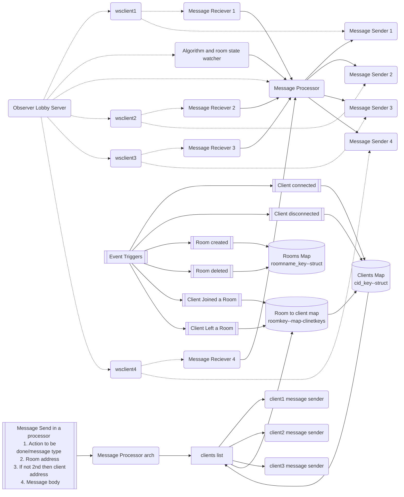
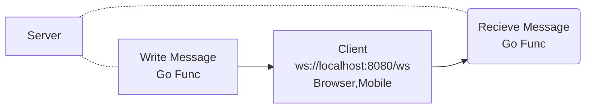
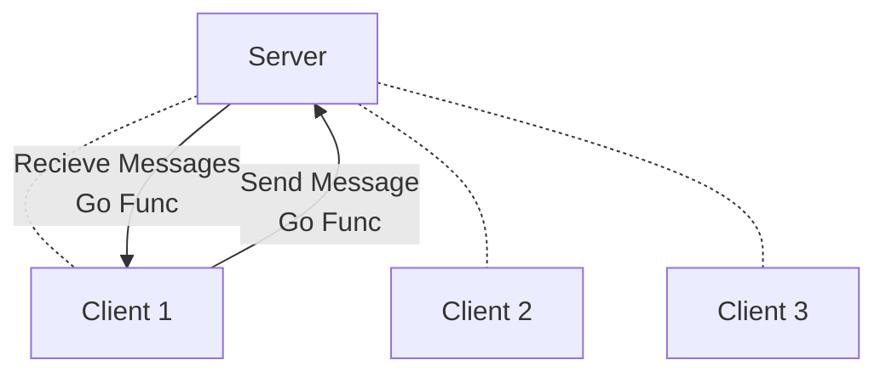
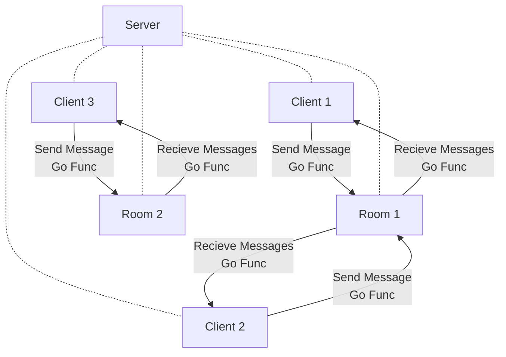

## Introduction

SimplySocket is built for real-time communication with clients, efficiently managing message broadcasting, room creation, and event handling. It's designed to scale well for multiplayer games and similar applications that require synchronized messaging across clients.

---

### Features

- **Message Broadcasting:** Efficiently push messages to multiple clients.
- **Room Management:** Create, delete, and manage rooms for organized communication.
- **Event Handling:** Trigger and handle various events seamlessly.

---

### Project Architecture

---

## Basics

A websocket server which is a protocol to do communication between server and client (browser, mobile etc) . Its asynchronized so the usage is in real time systems . Below will understand what are the blocks in the socket system and how SimplySocket manages it .

### Client

Client is a end user which has connected to our system via a User interface can be a web app, mobile application etc .
A client will need 2 concurrent functions one to send the message which it will push from the client side (web,mobile..)  and second to receive the message from the server and will get displayed on its side .

### Server

A websocket system will have a lots of clients joining it . A basic service which we expect is that a client push the message and all the clients receive it . Server's job is to maintain the client list and also to push the message to clients via a loop .

### Rooms

Looking a top this 2 logic is enough you can get a chat system ready but yeah you will push it to all the clients and is all open .  A notification system but all are the receivers of notification . 
A Room is a mid level abstraction kind of thing which will help to club up the clients . Server will have a job to maintain a `map[RoomName][]map[Client-Slug]clientprops`   . Rooms can also hold specific properties it wants for example total number of client your room can have , add some security layer over that room etc .

### Messages

Given the concept of rooms above and thinking of benefits it provides one obvious question should be how come a message a client will send to backend will be processed to send to a particular room and rest part will get handled by room . Here comes the concept for a message which we expect from client .

    type Message struct {
    Action string  `json:"action"`  //action
    MessageBody map[string]interface{} `json:"message_body"`  //message
    IsTargetClient bool  //not imported if its true then the Target string is a client which is one
    Target string  `json:"target"`  //target the room
    Sender string  `json:"sender"`  //whose readpump is used
    }
Above one is a snippet from SimplySocket Message which is passed through client and across the system .

 - **Action** :- This is kind of a task which a client is expecting to do for example in a chat system Action :- "send-message" means to broadcast the message . In a game system :- "start-the-game" might mean to trigger certain functions to start the game. 
 - **Message Body**:- interface based so can be custom struct . Obvious one will contain main message .
 - **IsTargetClient** :- This one is more oriented towards the backend Server system for example when a client joins a room you want to push a message like `Welcome client xyz` where as to all other you want to display `Client xyz joined a room` . So a simple flag and in Target part add client slug will redirect message to that client only .
 - **Target** :- Target is a room or a client where client wants to push the message.
 - **Sender** :- The client slug /id who has initiated the message if its from the server then it will have its name or a client slug .

## Contributing

We welcome contributions! Please feel free to submit issues, pull requests, or suggestions.

