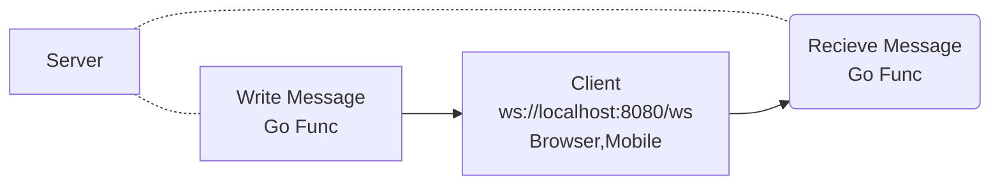
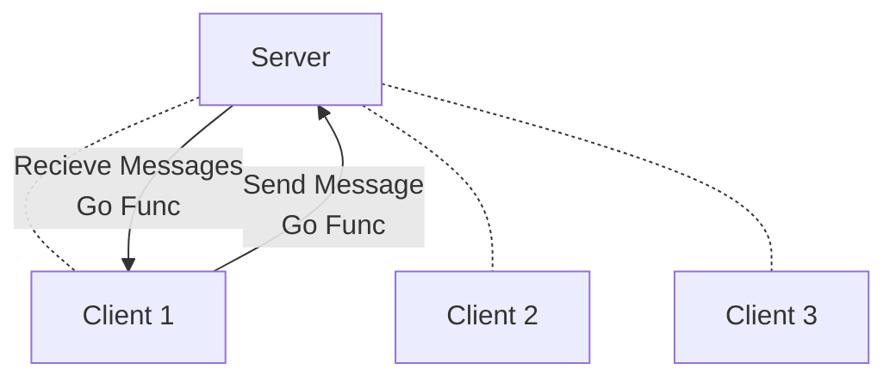
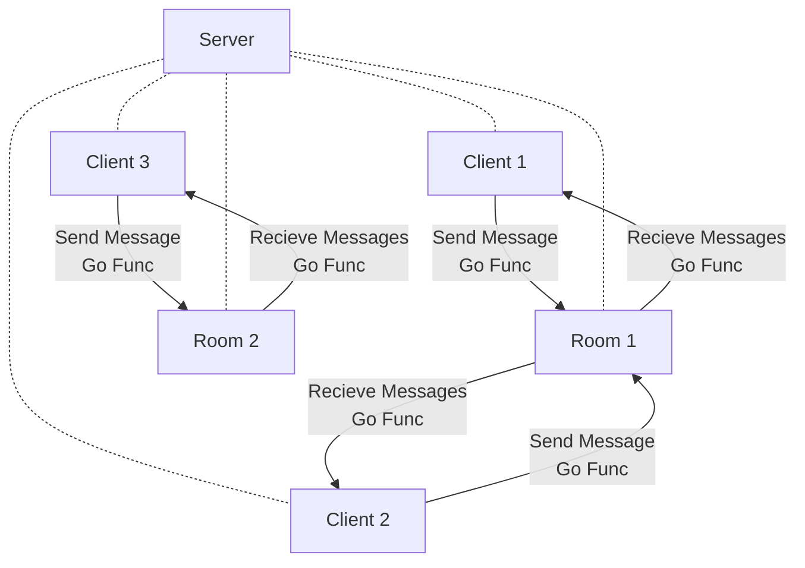

## Introduction

SimplySocket is built for real-time communication with clients, efficiently managing message broadcasting, room creation, and event handling. It's designed to scale well for multiplayer games and similar applications that require synchronized messaging across clients.

---

### Features

- **Message Broadcasting:** Efficiently push messages to multiple clients.
- **Room Management:** Create, delete, and manage rooms for organized communication.
- **Event Handling:** Trigger and handle various events seamlessly.

---

## Basics

A websocket server which is a protocol to do communication between server and client (browser, mobile etc) . Its asynchronized so the usage is in real time systems . Below will understand what are the blocks in the socket system and how SimplySocket manages it .

### Client

Client is a end user which has connected to our system via a User interface can be a web app, mobile application etc .
A client will need 2 concurrent functions one to send the message which it will push from the client side (web,mobile..)  and second to receive the message from the server and will get displayed on its side .



### Server

A websocket system will have a lots of clients joining it . A basic service which we expect is that a client push the message and all the clients receive it . Server's job is to maintain the client list and also to push the message to clients via a loop .



### Rooms

Looking a top this 2 logic is enough you can get a chat system ready but yeah you will push it to all the clients and is all open .  A notification system but all are the receivers of notification . 
A Room is a mid level abstraction kind of thing which will help to club up the clients . Server will have a job to maintain a `map[RoomName][]map[Client-Slug]clientprops`   . Rooms can also hold specific properties it wants for example total number of client your room can have , add some security layer over that room etc .



### Messages

Given the concept of rooms above and thinking of benefits it provides one obvious question should be how come a message a client will send to backend will be processed to send to a particular room and rest part will get handled by room . Here comes the concept for a message which we expect from client .

    type Message struct {
    Action string  `json:"action"`  //action
    MessageBody map[string]interface{} `json:"message_body"`  //message
    IsTargetClient bool  //not imported if its true then the Target string is a client which is one
    Target string  `json:"target"`  //target the room
    Sender string  `json:"sender"`  //whose readpump is used
    }
Above one is a snippet from SimplySocket Message which is passed through client and across the system .

 - **Action** :- This is kind of a task which a client is expecting to do for example in a chat system Action :- "send-message" means to broadcast the message . In a game system :- "start-the-game" might mean to trigger certain functions to start the game. 
 - **Message Body**:- interface based so can be custom struct . Obvious one will contain main message .
 - **IsTargetClient** :- This one is more oriented towards the backend Server system for example when a client joins a room you want to push a message like `Welcome client xyz` where as to all other you want to display `Client xyz joined a room` . So a simple flag and in Target part add client slug will redirect message to that client only .
 - **Target** :- Target is a room or a client where client wants to push the message.
 - **Sender** :- The client slug /id who has initiated the message if its from the server then it will have its name or a client slug .

---

## Example 

This is the example from wordsbattle codebase which runs [miniwordgames.com](http://miniwordgames.com)

### NewMeshServer
Setup the server where it will have all clients and rooms information , roomdata is your information through which a room global will be created and holds the information which you can access interface .
```golang
roomdata := &game.RoomData{RandomRooms: []string{}}
ms := simplysocket.NewMeshServer("cowgame", &simplysocket.MeshServerConfig{DirectBroadCast: false}, roomdata)
// initialize websocket link cowgame connection clash of words
r.HandleFunc("/wsmesh", func(w http.ResponseWriter, r *http.Request) {
	simplysocket.ServeWs(ms, w, r)
})
```
[link to code](https://github.com/DhruvikDonga/wordsbattle/blob/main/internal/handler/routes.go#L46)

### HandleRoomData

Implement HandleRoomData function in your codebase  . This function is the go routine which runs when a newmeshserver is created . The objects will have the property which you wanted to give and can be accessed . In below funciton RoomData is the struct of the object of newMeshServer created . 
```golang
func (r *RoomData) HandleRoomData(room simplysocket.Room, server simplysocket.MeshServer) {
	roomname := room.GetRoomSlugInfo()
	r.Slug = roomname
	log.Println("Handeling data Server for ", roomname, server.GetGameName())
	// ticker := time.NewTicker(5 * time.Second)
	// defer ticker.Stop()
	for {
		select {
		case message, ok := <-room.ConsumeRoomMessage():
			//log.Println(server.GetRooms())
			if !ok {
				log.Println("Channel closed. Exiting HandleRoomData for", roomname)
			}
			log.Println("Room data ", message)

			if message.Target == roomname {
				r.handleServermessages(room, server, message)
			}

		case clientevent := <-room.EventTriggers():
			log.Println("Event triggered", clientevent[0], clientevent[1], clientevent[2], room.GetRoomSlugInfo())

		// case <-ticker.C:
		// 	log.Println("Room activity server", room.GetRoomSlugInfo(), r.Slug)

		case <-room.RoomStopped():
			log.Println("Room is stopped so stop the handler")
			return

		}
	}
}
```
[link to code](https://github.com/DhruvikDonga/wordsbattle/blob/main/internal/modules/game/handle.go#L30)

### room.GetRoomSlugInfo()
``room.GetRoomSlugInfo()`` will give you the room id

### room.GetRoomMakerInfo() 
``room.GetRoomMakerInfo()`` will give you the client id which created this room

### room.GetClientsInRoom() 
``room.GetClientsInRoom()`` will return ``map[string]map[string]*client`` roomids->clientids [check example](https://github.com/DhruvikDonga/wordsbattle/blob/main/internal/modules/game/handle.go#L107)

### room.ConsumeMessage()
``room.ConsumeMessage()`` will send messages from the client side to the server . It can be removed if you have a service which push the message . 

### room.EventTriggers()
``room.EventTriggers()`` will send events it is string list where 1st is the event name which can be client-joined-room , client-left-room , 2nd part is the roomname , 3rd part is clientuniqid . This will help you to implement further logics [like here in wordsbattle](https://github.com/DhruvikDonga/wordsbattle/blob/main/internal/modules/game/gamroomhandle.go#L56)

### room.RoomStopped()
``room.RoomStopped()`` will notify room is stopped this will happen when no client is there in the room . Implement this in custom funciton for better go routine management .

### simplysocket.Message{}
This is the standard Message struct which simplysocket process and push it . Keep the same struct pattern in client side as well
Action: as same as a Title of message
Target: Its a room id or client id
MessageBody: map interface of message to be send
isTargetClient: flag to send message to a client only
```golang 
	res := &simplysocket.Message{
			Action:         "room-setting-applied",
			Target:         message.Target,
			MessageBody:    map[string]interface{}{"message": "Room settings applied successfully Player Limit:- " + message.MessageBody["player_limit"].(string) + " Time duration :-" + message.MessageBody["game_duration"].(string)},
			Sender:         "bot-of-the-room",
			IsTargetClient: false,
		}
```

### room.BroadcastMessage(message)
``room.BroadcastMessage(message)`` will broadcast the message . room will have the client list in it . This will push message to all clients in it but if it needs to be send to a particular client set IsTargetClient to ``true`` in message.
```golang
func (r *RoomData) FailToJoinRoomNotify(reason string, clientsinroom []string, room simplysocket.Room, server simplysocket.MeshServer) {
	reasonmsg := ""
	log.Println("Client removed", clientsinroom[2])
	if reason == "room-full" {
		reasonmsg = "Failed to join the room its occupied"
	}
	message := &simplysocket.Message{
		Action: "fail-join-room-notify",
		Target: clientsinroom[2],
		MessageBody: map[string]interface{}{
			"message": reasonmsg,
		},
		Sender:         "bot-of-the-room",
		IsTargetClient: true,
	}

	room.BroadcastMessage(message)
}
```
[link to code](https://github.com/DhruvikDonga/wordsbattle/blob/main/internal/modules/game/handle.go#L136)

### server.JoinClientRoom(roomname string, clientname string, rd RoomData)
 
``server.JoinClientRoom(roomname string, clientname string, rd RoomData)`` :- This function takes roomname uniq id , client uniq slug id and a object of the struct which you have created . So the approach is simplysocket checks whether a room is already there a roomname which you added if not then it will use object and create a room and it will add your client . SimplySocket self initializes a room ```mesh-global``` where a client is automatically added . It contains list of all clients in it. This mechanism will help you to create different rooms with different properties to play with . 

A room created with a object of particular struct must need to implement ``HandleRoomData`` . Incase of wordsbattle there are 2 type of rooms one which is mesh-global has its [implementation)](https://github.com/DhruvikDonga/wordsbattle/blob/main/internal/modules/game/handle.go#L30) and a game room [implementation](https://github.com/DhruvikDonga/wordsbattle/blob/main/internal/modules/game/gamroomhandle.go#L41) . 

```golang
case "join-room":
		//needed only if new room is needed
		rd := GameRoomData{
			IsRandomGame:     false,
			PlayerLimit:      int(message.MessageBody["playerlimit"].(float64)),
			ClientProperties: make(map[string]*ClientProps),
			GameEnded:        make(chan bool),
			Wordslist:        make(map[string]bool),
			Endtime:          1 * 60,
			Rounds:           0,
			TurnAttempted:    make(chan []string),
			HasGameStarted:   false,
			HasGameEnded:     false,
			ClientTurnList:   []*ClientProps{},
		}
		log.Println("JoinRoomAction ", message.Sender, message.MessageBody, room.GetRoomSlugInfo())
		roomname := message.MessageBody["roomname"].(string)
		server.JoinClientRoom(roomname, message.Sender, &rd)
		log.Println("request send to join a room")
```
[link to code](https://github.com/DhruvikDonga/wordsbattle/blob/main/internal/modules/game/handle.go#L86)

## Contributing

We welcome contributions! Please feel free to submit issues, pull requests, or suggestions.

